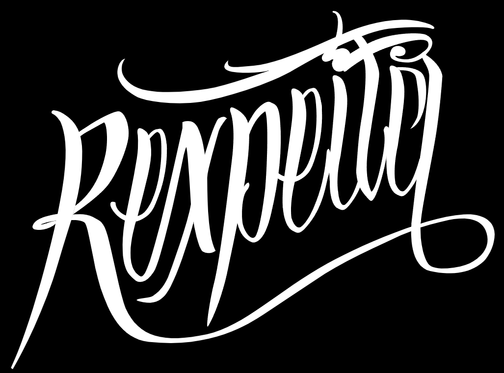

# E-commerce Project for Rexpeita Store

 

**To view the project, click [here](https://rexpeita-ecommerce.netlify.app/index.html).**

This is the e-commerce project for the Rexpeita store, a fictional store based on an existing brand. The goal of this project was to create a complete e-commerce platform, including login, registration, cart, FAQ, and individual product pages.

## Technologies Used

- HTML
- CSS
- SASS
- JavaScript

## Responsiveness

The project was developed with responsiveness in mind, utilizing tools like Responsive Viewer, DevTools, and Mobile Simulator. While it posed a challenge, all screens have been adapted for various device sizes.

## Key Features

- Advanced styling of inputs on the login and registration screens.
- Implementation of a functional hamburger menu.
- Use of dropdowns to display additional product information.

## Future Contributions

While the project is complete, there's always room for improvements and expansions. Some suggestions for future contributions include:

- Integration with a database for product, order, and user management.
- Implementation of a payment system.
- Addition of advanced features, such as search filters and product sorting.

## Final Remarks

This e-commerce project provided a great opportunity to enhance my web development skills. Through the use of HTML, CSS, SASS, and JavaScript, I was able to create a stylish and functional project, adding value to my portfolio.

 
 

## **Português:**

# Projeto E-commerce da Loja Rexpeita

 

**Para visualizar o projeto, clique [aqui](https://rexpeita-ecommerce.netlify.app/index.html).**

Este é o projeto e-commerce da loja Rexpeita, uma loja fictícia baseada em uma marca existente. O objetivo deste projeto foi criar um e-commerce completo, incluindo tela de login, cadastro, carrinho, FAQ e páginas de produtos individuais.

## Tecnologias Utilizadas

- HTML
- CSS
- SASS
- JavaScript

## Responsividade

O projeto foi desenvolvido levando em consideração a responsividade, utilizando como base as extensões Responsive Viewer, DevTools e Mobile Simulator. Embora tenha sido um desafio, todas as telas foram adaptadas para diferentes tamanhos de dispositivos.

## Recursos Destacados

- Estilização avançada dos inputs em tela de login e cadastro.
- Implementação de um menu hamburger funcional.
- Utilização de dropdowns para exibição de informações adicionais sobre os produtos.

## Contribuições Futuras

Embora o projeto esteja completo", sempre há espaço para melhorias e expansões. Algumas sugestões de contribuições futuras incluem:

- Integração com um banco de dados para gerenciamento de produtos, pedidos e usuários.
- Implementação de um sistema de pagamento.
- Adição de funcionalidades avançadas, como filtros de busca e classificação de produtos.

## Considerações Finais

Este projeto de e-commerce foi uma ótima oportunidade para aprimorar minhas habilidades de desenvolvimento web. Através da utilização de HTML, CSS, SASS e JavaScript, pude criar um projeto estilizado e funcional, agregando valor ao meu portfólio.
